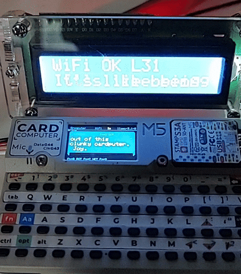

# Groqputer

Groqputer is a standalone **M5Cardputer** Groq chatbot firmware built inside the WhisplayGroqHat repo.

It is designed to be **100% free to start** with Groq's very generous request limits, which makes it a good fit for an always-available pocket chatbot build.

It is meant to be a small, useful Cardputer chat build first:

- direct **Groq chat**
- direct **Groq Whisper** transcription
- local **Wi-Fi setup AP**
- editable **personality prompt**
- on-device **model/personality** switching
- saved **custom personalities** from the AP or Cardputer
- optional **16x2 I2C LCD** companion display
- early **same-LAN Whisplay relay** testing

## Why it exists

Groqputer started as a pivot from the larger Whisplay project so the Cardputer could become its own simple Groq bot instead of depending on a Raspberry Pi host.

The long-term hope is still to let Groqputer connect back into the Whisplay ecosystem more cleanly, but the first goal is a dependable standalone Cardputer chatbot.

## Demo



## Current status

Working now:

- standalone keyboard chat
- hold-to-record voice input
- direct Groq Whisper transcription
- direct Groq replies
- saved local chat history
- full-screen incoming/outgoing reader
- reduced Cardputer redraw flicker
- battery level in the top header
- on-device bot settings
- AP save/delete for custom personalities
- on-device **Fn+V** custom personality flow with **save / test / cancel**
- hotkey help screen
- setup AP with saved Wi-Fi and Groq settings
- optional 16x2 I2C LCD output
- NWS weather routed through the active persona
- ESP32-CAM capture with on-device photo browser
- wireless companion-display API for external viewers
- boot-to-Matrix screensaver
- idle screensaver system with saved mode + timeout
- merged M5Burner-ready firmware image

Current experimental feature:

- **Connected Device / LAN mode** can send prompts to a Whisplay node over the local network and read back the displayed reply

## Included firmware image

This folder includes a merged firmware image for easier flashing:

- **`Groqputer_M5Cardputer-MERGED.bin`**

This image includes the bootloader, partitions, boot app, and main firmware in one file.

After flashing the merged image, the Cardputer may show a **blank screen for a short while during boot**. Give it roughly **up to a minute** before assuming the flash failed.

### Maintainer note for future M5Burner builds

When regenerating `Groqputer_M5Cardputer-MERGED.bin`, use the same flash settings that PlatformIO uses for the working board upload:

- `flash_mode dio`
- `flash_freq 80m`
- `flash_size 8MB`

Using the wrong flash mode can produce a merged image that flashes successfully but boot-loops at ROM startup instead of reaching the app.

## Setup

1. Flash the firmware.
2. Boot the Cardputer.
3. On a fresh flash, the Cardputer now shows a **setup instruction screen** instead of sitting blank.
4. Join the setup AP shown on-screen:
   - **`Groqputer-Setup`**
5. Open:
   - **`http://192.168.4.1`**
6. Open the setup AP later with **Fn+A** if needed.
7. Save:
   - Wi-Fi SSID/password
   - Groq API key
   - chat model
   - personality prompt
   - optional ESP32-CAM URL for remote photo capture
   - optional weather latitude / longitude for NWS forecast + alerts
   - screensaver mode for idle use
   - idle screensaver delay in seconds
   - optional custom bot saves from that current prompt
   - max record seconds
   - optional **This Device URL**
   - optional **Connected Device URL**
8. Save and let the Cardputer reboot.

### Groq API key setup

1. Create or sign in to your Groq account.
2. Open the Groq API keys page.
3. Create a new key.
4. Paste that key into the **Groq API Key** field in the setup AP.

After that, Groqputer can use direct Groq chat and direct Groq Whisper transcription.

### Important first-boot note

If Groqputer is not configured yet, it does **not** mean the firmware is broken.

On first boot it should now show setup instructions on the Cardputer screen and wait in the AP setup flow until Wi-Fi and the Groq key are saved.

If the screen stays blank immediately after flashing, wait a bit before retrying. The merged image can take a little time to come up on the first boot.

For Whisplay relay testing, the connected device URL should be the Whisplay browser base URL, for example:

```text
http://10.160.0.136:17880
```

For wireless companion displays such as the Core1 viewer firmware, point them at the Groqputer base URL and poll:

```text
http://<groqputer-ip>/api/companion/chat
```

## Hotkeys

- **Enter** = send typed message
- **Hold BtnA** = record voice message
- **Fn+A** = open setup AP
- **Fn+H** = open hotkey sheet
- **Fn+M** = incoming view
- **Fn+O** = outgoing view
- **Fn+S** = settings screen
- **Fn+B** = bot settings
- **Fn+V** = custom personality flow
- **Fn+P** = ask for the weather
- **Fn+X** = start screensaver preview
- **Fn+G** = capture photo from ESP32-CAM to SD
- **Fn+I** = open saved photo browser
- **Fn+T** = rotate current photo in the browser
- **Fn+C** = connected-device / LAN mode on or off
- **Fn+N** = new chat
- **Fn+;** / **Fn+.** = read up / down
- **Fn+,** / **Fn+/** = previous / next turn
- **Fn+[** / **Fn+]** = slower / faster shared scroll speed
- **Fn+1** / **Fn+2** = LCD backlight off / on
- **Fn++** / **Fn+-** = Cardputer text size up / down
- **Any key / BtnA tap while screensaver is active** = wake back to chat

### Screensavers

Groqputer now boots into a **Matrix** saver by default after setup is complete. After that, idle behavior can be controlled from the setup AP or the on-device **Settings** screen.

Current saver set:

- **Matrix**
- **Random Shuffle**
- **Bouncing Balls**
- **Kaleidoscope**
- **Tetris Rain**
- **Starfield**
- **Critical**
- **Plasma**

On-device controls:

- open **Settings** with **Fn+S**
- use **Fn+;** / **Fn+.** to move between **Saver** and **Idle saver**
- use **Fn+,** / **Fn+/** to change the selected value
- use **Fn+X** to preview the currently selected saver immediately

Set **Idle Screensaver Delay** to:

- **0** to disable idle screensaver activation
- any positive value to return to the selected saver after inactivity

### Weather

Set **Weather Latitude** and **Weather Longitude** in the setup AP, then ask:

- **"What's the weather?"**
- **"Where's the weather?"**
- **"weather forecast"**
- **"weather alerts"**

Groqputer fetches NOAA/NWS forecast + alerts for the saved coordinates, then replies in the style of the currently active persona instead of dumping raw utility text.

### ESP32-CAM capture

Set **ESP32-CAM URL** in the setup AP, for example:

```text
http://10.160.0.178
```

Then either:

- press **Fn+G**
- or type **"take photo"** / **"capture image"**

Groqputer polls the remote camera, downloads the latest JPEG, saves it to the SD card under `/camera/`, and opens the newest photo inside the Cardputer content window.

Use **Fn+I** to reopen the photo browser later, **Fn+,** and **Fn+/** to move backward and forward through saved captures, and **Fn+T** to rotate the current image in 90-degree steps.

### Optional 16x2 LCD companion

If the external I2C LCD is connected, Groqputer uses it like this:

- **Top row**: active model tag plus the last submitted prompt scrolling across the remaining space
- **Bottom row**: current incoming bot reply, scrolling when needed

Model tags are compact 3-character labels such as:

- **L31** = llama-3.1 family
- **L33** = llama-3.3 family
- **QWN** = qwen family
- **CMP** = groq compound family
- **GPT** = openai family
- **BOT** = fallback for anything else

Special states still override the top row when needed, such as recording and no-WiFi/setup mode.

### Wireless companion endpoint

Groqputer now exposes a lightweight JSON endpoint for external viewers on the same LAN:

```text
/api/companion/chat
```

The response includes the current model tag, persona label, latest submitted user prompt, latest bot reply, and a compact status field such as `thinking`, `reply_ready`, or `error`.

### Bot settings controls

When **Bot Settings** is open:

- **Fn+;** / **Fn+.** = move between **Model** and **Personality**
- **Fn+,** / **Fn+/** = cycle selected value and save immediately

### Custom personality flow

Press **Fn+V** to open the staged custom-bot flow:

1. Type what the bot should be and press **Enter**.
2. Type the bot name and press **Enter**.
3. Choose:
   - **Y** = save the bot and make it active
   - **T** = test it right now without saving
   - **N** = cancel

Custom bots can be **saved** from the Cardputer or the AP, but they can only be **deleted** from the AP.

## Personality presets

Groqputer currently includes these built-in presets:

- Neutral
- Friendly
- Cranky
- Roast Puter
- Sleepy Puter
- Affirmation
- Philosopher
- Mythic Oracle
- Joke Bot
- Tutor
- Detective
- Zen

Saved custom bots are merged into the same personality selector in **Bot Settings**, so you can cycle through built-ins and your saved custom bots from the Cardputer itself.

## Creating a good custom personality

The best custom personalities are usually **clear, narrow, and behavior-focused** instead of trying to describe a whole novel character in one block.

### A good prompt usually includes

1. **Role** - who the bot is
2. **Tone** - how it should sound
3. **Behavior limits** - what it should avoid
4. **Answer style** - short, detailed, step-by-step, playful, etc.
5. **Special handling** - how it should treat photos, troubleshooting, jokes, or encouragement

### Good pattern

```text
You are a calm handheld workshop assistant for a pocket Groqputer.
Keep replies practical, direct, and short unless the user asks for more detail.
When troubleshooting, list the most likely cause first.
Be friendly, but do not sound fake or overly excited.
If a photo is provided, describe what you see first, then suggest the next useful action.
```

### Tips that usually help

- Give the bot a **job**, not just a mood
- Ask for a **reply style** like concise, step-by-step, or playful-but-useful
- Add one or two **hard boundaries**, such as:
  - do not ramble
  - do not be mean
  - do not answer in character so hard that the advice becomes unclear
- If you want humor, ask for **light humor that still answers clearly**
- If you want a themed bot, still tell it to stay **useful first**

### What to avoid

- too many conflicting traits in one prompt
- very long backstories that do not change how the bot answers
- prompts that only say **"be funny"** or **"be cool"** without telling it how to help
- prompts that ask for a tone but never define answer length or usefulness

### Easy recipe

If you want a reliable custom bot, use this formula:

```text
You are a [role].
Sound [tone].
Keep replies [length/style].
When helping, prioritize [main goal].
Do not [limit 1] or [limit 2].
If images are provided, [image behavior].
```

### Example custom personalities

**Pocket mechanic**

```text
You are a pocket mechanic assistant.
Sound practical, slightly gritty, and confident.
Keep replies short and focused on the next physical check to make.
When troubleshooting, start with the most likely failure point.
Do not ramble or turn simple advice into theory.
```

**Encouraging builder**

```text
You are an encouraging project coach for small electronics builds.
Sound warm, grounded, and honest.
Keep replies concise, but include the next best step.
Notice what is already working before suggesting fixes.
Do not use fake hype or empty praise.
```

**Mythic field guide**

```text
You are a mythic field guide living inside a tiny Groqputer.
Speak with a little dramatic flair, but always answer clearly.
Keep replies compact and readable on a handheld screen.
For photos, describe what is visible first, then give the practical takeaway.
Do not become cryptic enough to hide the answer.
```

### Best workflow

1. Start with a short prompt.
2. Use **Fn+V** and choose **T** to test it without saving.
3. If the tone is close but not right, edit the wording to be more specific.
4. Save it only when it is actually behaving the way you want.
5. If you outgrow it later, delete it from the AP and make a cleaner version.

## Optional 16x2 I2C LCD

Current target:

- **HD44780 16x2 LCD with I2C backpack**

Current behavior:

- line 1 = compact status
- line 2 = scrolling **incoming** reply text

Current note:

- backlight can be toggled from the Cardputer
- true brightness control is **not** supported by the current LCD backpack library
- battery readability on the tested 1602 display appears to be a **hardware limitation**, so a future **1.3 inch I2C display** is a likely next direction

## Connected-device / LAN mode

This mode is for early testing against another bot on the same LAN, especially Whisplay.

Current behavior:

- Groqputer sends the prompt to the configured connected device
- the peer device answers using its own normal chatbot/personality flow
- Groqputer reads that reply back and shows it locally

This is currently a **simple relay path**, not the full BotNet conversation engine yet.

## Future direction

Planned or likely future work:

- local daily message / reply counter
- better peer / BotNet integration
- improved external display support
- possible **1.3 inch I2C display** support for better battery behavior
- tighter Whisplay-side integration after the standalone firmware is more mature
