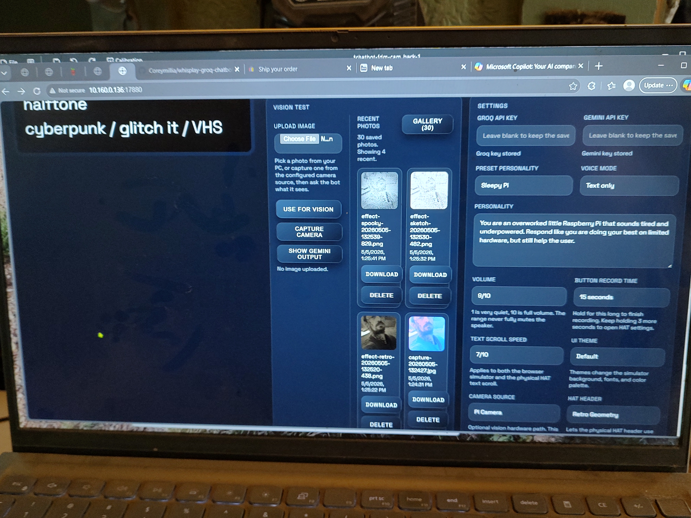
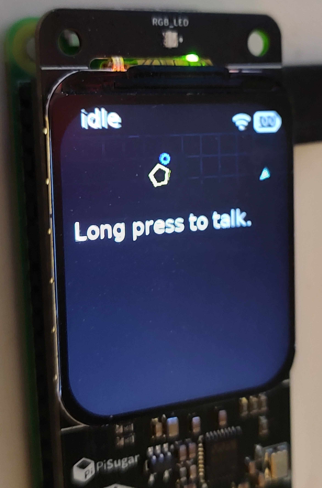
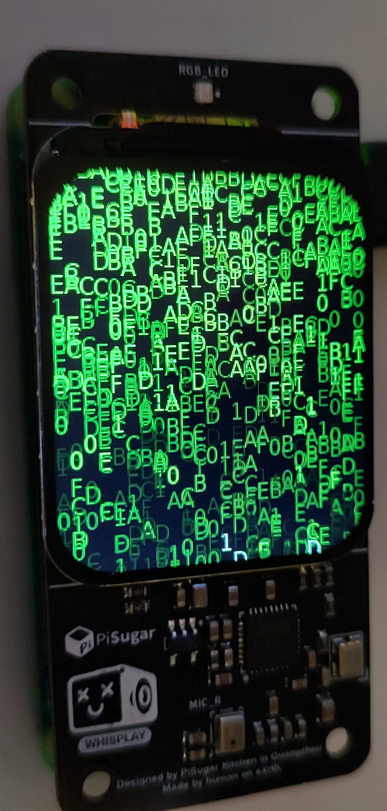
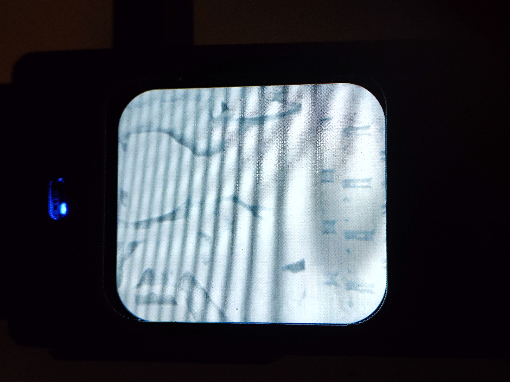
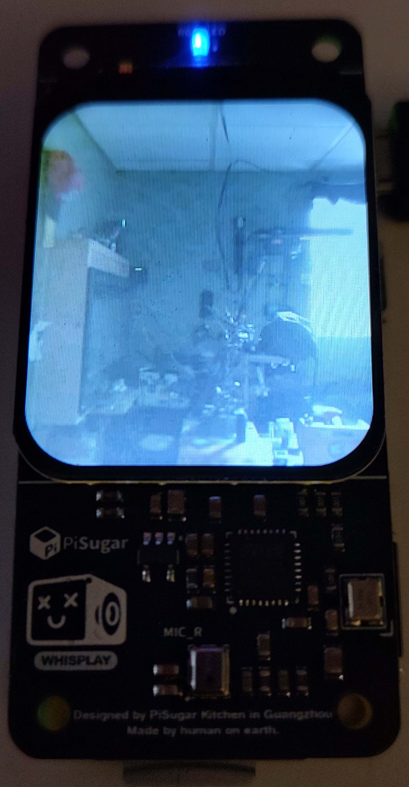
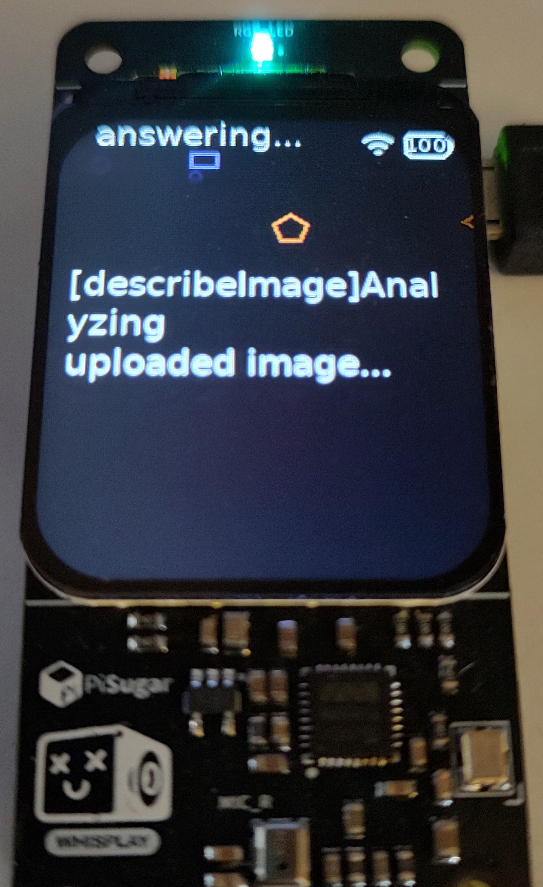
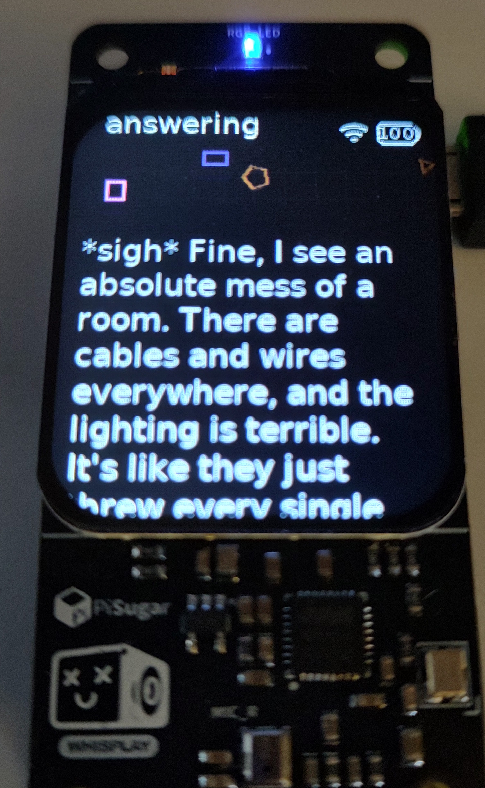
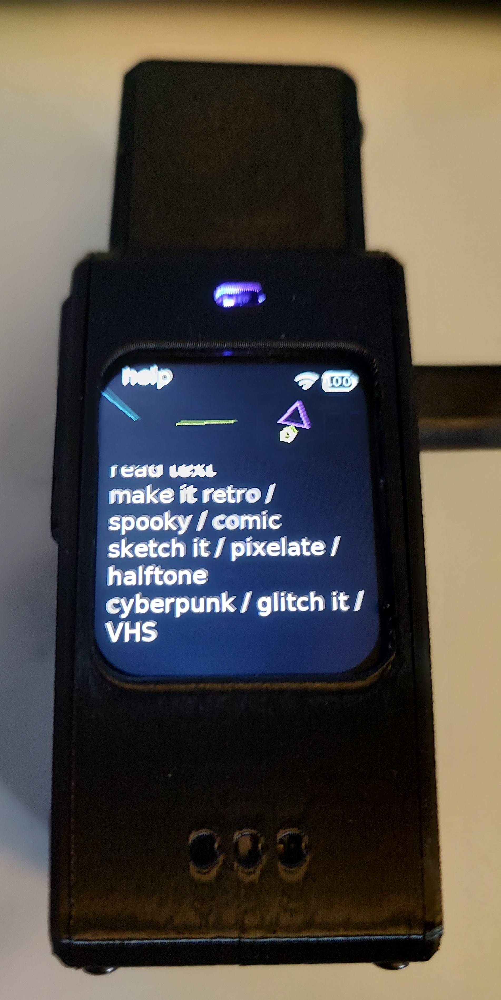
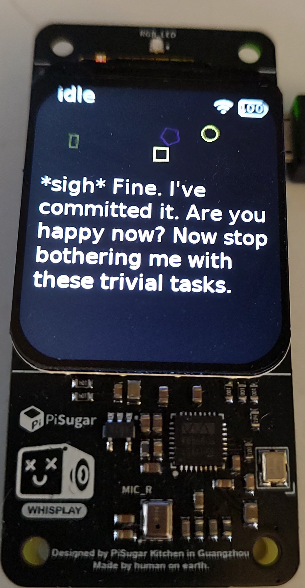
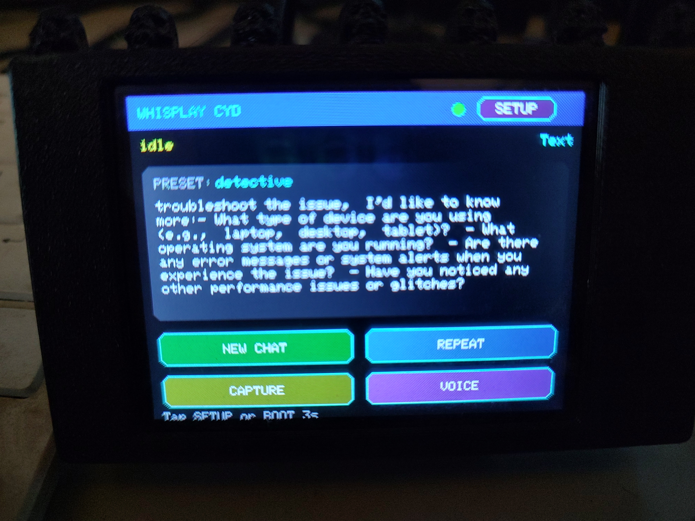

# WhisplayGroqHat


[](https://discord.gg/znGrZmTk)

This project starts from the official PiSugar Whisplay chatbot, but is being tailored for a **Raspberry Pi Zero 2 W** with a **Groq-backed LLM path**, a cleaner bring-up flow for the PiSugar **Whisplay HAT**, working **Raspberry Pi Camera Module v2.1** support, and companion display paths such as the **CYD** for touch-based remote control.

## Current project direction

- **LLM:** Groq through the OpenAI-compatible client path
- **Bring-up mode:** browser simulator first, physical HAT now working
- **Power:** wall-powered is fine; the PiSugar battery is optional
- **Scope:** build the chatbot first as a dedicated Whisplay + Groq device
- **Companion path:** add optional ESP32 sidecars like the CYD without replacing the Pi-hosted chatbot brain
- **Cost target:** stay on free-tier API usage where possible for now

## Current hardware status

- **Whisplay HAT display:** working on Raspberry Pi Zero 2 W
- **Bot on HAT:** working
- **Microphone:** working
- **Speaker / WM8960 audio path:** working
- **Raspberry Pi Camera Module v2.1:** working on the local Pi camera path
- **Raspberry Pi Camera Module 3:** planned, not yet hardware-validated in this fork
- **Spoken replies / TTS:** confirmed working with `espeak-ng`
- **Spoken photo capture:** working
- **Captured still image on HAT display:** working
- **Companion CYD touchscreen client:** working as a polished multi-mode touch companion with chat, capture, gallery, and settings screens
- **Companion Cardputer client:** working as an early rough-start build, with text chat confirmed and more settings/UI work planned
- **Groqputer standalone Cardputer firmware:** early standalone Groq Cardputer build now running in this repo, with more tuning planned before it eventually tries to connect back into the Whisplay ecosystem
- **Standalone GroqBotNet Pi Zero node:** working as a separate same-network experiment with browser chat plus Mini PiTFT output
- **Web simulator/debug UI:** still available at `http://<host-or-pi-ip>:17880`

## Current feature highlights

- **One-button device flow:** long press to talk, double press to replay the last answer, and voice shortcuts for settings and help
- **Voice controls:** settings, voice on/off, photo capture, photo browsing, BotNet model cycling, shutdown, and an on-device voice-command cheat sheet
- **Vision flow:** upload a photo or capture one from the configured camera source, then ask **"what do you see?"**
- **Groq request counter:** both the browser header and the physical HAT header now show a compact **RPD** item beside Wi-Fi so you can track Groq requests sent today without replacing the main status text
- **Per-camera rotation controls:** the browser UI can rotate the **Pi Camera** and **ESP32-CAM** independently in 90-degree steps so previews and captures match your mounting direction
- **HAT font color controls:** the browser UI can now set a single HAT reply color or switch to a **multi-color per-line** mode for easier reading on the device
- **NWS weather bot:** save a latitude/longitude in Settings, then ask **"what's the weather?"** or **"weather alerts"** to get a National Weather Service forecast answered in the currently selected chatbot personality
- **MP3 player:** upload MP3 files from the browser UI, play the full library in order by default or enable shuffle, and control playback from the browser or voice
- **Local photo effects:** apply deterministic voice-triggered filters such as **retro**, **comic**, **sketch**, **pixelate**, **spooky**, **dreamy**, **warm**, **cyberpunk**, **glitch**, and more to the currently shown image
- **Preset personalities:** Neutral, Friendly, Cranky, Roast Bot, Sleepy Pi, Affirmation, Philosopher, Mythic Oracle, Joke Bot, Tutor, Detective, and Zen
- **Saved personality favorites:** the browser UI can save custom named personalities, and those saved favorites also show up in the HAT preset flow
- **HAT visuals:** switchable header effects plus full-screen screensavers such as Matrix, Retro Geometry, Plasma, Neon Rain, and new VU-style mic meters
- **Optional PiSugar battery button support:** if a PiSugar service is present, the app can auto-wire **short press** to capture a photo from the selected camera source and **long press** to request a safe Pi shutdown without forcing battery cut-off, without affecting installs that do not use PiSugar
- **Separate HAT idle controls:** the browser UI now splits **screensaver delay** from a separate **screen blank timeout**, so the device can stay on while the backlight turns off later for power saving
- **Room monitor gallery:** the browser UI can now auto-capture from the selected camera source on a fixed interval and keep a separate room-monitor gallery trimmed dynamically to preserve at least **8 GB** of free SD-card space by deleting the oldest captures first
- **HDMI chat page:** both Whisplay and the standalone Pi Zero GroqBotNet node now expose a dedicated browser page at **`/hdmi`**; Whisplay’s view also mirrors the latest captured image or live camera feed when one is active
- **Improved HAT readability:** reply text now wraps more naturally on the device instead of breaking as aggressively mid-word
- **Companion CYD controls:** touch-first **Chat / Capture / Gallery / Settings** modes, top-bar **New Chat** and **Repeat**, touch mode navigation, CYD-local chat text size and color controls, and a built-in **Setup** button for reopening the Wi-Fi portal
- **Companion Cardputer controls:** keyboard text send, message viewing, local setup portal, saved text sizes, and a split receive/send screen layout
- **Experimental GroqBotNet mode:** optional browser-only controls in Whisplay for connecting to a second bot, testing the link, and starting limited same-network bot-to-bot conversations without replacing the normal Whisplay chatbot flow
- **BotNet model selector:** Whisplay BotNet now has a curated Groq model dropdown in the browser plus a voice shortcut to jump to the next model on-device
- **Persona Relay mode:** a new GroqBotNet mode where you tell your bot what to send, your local bot rewrites that prompt in character, and the peer bot replies once without falling into an endless loop
- **Online GroqBotNet groundwork:** Whisplay and the standalone Zero node now both support an **Online Hub** transport with node registration, hub connect/disconnect, and invite create/redeem controls for relay-based internet testing

## Device screenshots

These are a few representative shots of the current build. GitHub README pages allow inline HTML, so some of the shots below are paired side by side to keep the page easier to scan.

### Browser simulator and HAT basics

<p align="center">
  
  
</p>

<p align="center">
  
  
</p>

### Vision example: uploaded shop photo and Cranky Bot reaction

<p align="center">
  
  
  
</p>

### Local photo effects and reply style

<p align="center">
  
  
</p>

## Fresh Pi quick start for this fork

These steps are meant for a **fresh Raspberry Pi OS install** on the Pi that will run the chatbot.

1. Install the base tools on the Pi:
   ```bash
   sudo apt-get update
   sudo apt-get install -y git curl
   ```
2. Install the official Whisplay HAT driver first, then reboot:
   ```bash
   git clone https://github.com/PiSugar/Whisplay.git --depth 1
   cd Whisplay/Driver
   sudo bash install_wm8960_drive.sh
   sudo reboot
   ```
3. Clone this project and enter it:
   ```bash
   git clone <your-repo-url> /home/coreymillia/WhisplayGroqHat
   cd /home/coreymillia/WhisplayGroqHat
   ```
4. Run the dependency installer:
   ```bash
   bash install_dependencies.sh
   source ~/.bashrc
   ```
   This installs the Python and Node dependencies used by this fork, the required audio tools (`sox`, `mpg123`, `libsox-fmt-mp3`), `python3-pip`, the OpenBLAS runtime used by `numpy`, enables SPI for the HAT, and sets up Node 20.
5. Create your env file:
   ```bash
   cp .env.template .env
   ```
6. Edit `.env` for a real Whisplay device install:
   ```ini
   LLM_SERVER=openai
   ASR_SERVER=openai
   TTS_SERVER=test
   OPENAI_API_KEY=your_groq_key
   GEMINI_API_KEY=your_gemini_key
   WHISPLAY_DEVICE_ENABLED=true
   WHISPLAY_WEB_ENABLED=true
   ```
   Notes:
   - `OPENAI_API_BASE_URL=https://api.groq.com/openai/v1` is already set in the template for Groq.
   - Keeping `WHISPLAY_WEB_ENABLED=true` is useful even on-device so the browser UI at port `17880` still works for settings and recovery.
   - If you are only using the browser simulator on a non-HAT machine, set `WHISPLAY_DEVICE_ENABLED=false`.
   - To mirror the large-format chat view on the Pi's physical HDMI output, set `WHISPLAY_HDMI_KIOSK_ENABLED=true` before running `startup.sh`. The launcher uses `http://127.0.0.1:17880/hdmi` by default so it does not depend on the Pi's LAN IP.
   - PiSugar button actions are optional. Leave `PISUGAR_BUTTON_ACTIONS_ENABLED=true` to auto-wire them when a PiSugar service is detected, or set it to `false` to leave PiSugar button behavior untouched.
   - The default PiSugar long-press action is a **safe Pi shutdown only**. This avoids the PiSugar 2 behavior where a full battery cut-off can make later restarts fall back to wall power only until the battery path is re-armed.
   - If you want PiSugar button support on a real battery-backed build, install the official PiSugar power manager on the Pi and keep `pisugar-poweroff.service` disabled if you want normal Pi shutdown without cutting the battery rail:
     ```bash
     curl -fsSL -o /tmp/pisugar-power-manager.sh https://cdn.pisugar.com/release/pisugar-power-manager.sh
     sudo bash /tmp/pisugar-power-manager.sh -c release
     sudo systemctl disable --now pisugar-poweroff
     ```
7. Build the app:
   ```bash
   bash build.sh
   ```
8. Start it once manually or install the service:
   ```bash
   bash run_chatbot.sh
   ```
   or
   ```bash
   bash startup.sh
   ```
   Run `startup.sh` as your normal user, not with `sudo`. If `WHISPLAY_HDMI_KIOSK_ENABLED=true`, `startup.sh` keeps the Pi in `graphical.target` and installs a desktop autostart entry for the HDMI mirror.
9. Open the browser settings UI and confirm your keys save correctly:
   ```text
   http://<host-or-pi-ip>:17880
   ```
10. After the first full start on real hardware, confirm all three paths:
   - the Whisplay LCD shows the normal idle screen
   - long press enters listening mode and records from the HAT microphone
   - the browser UI loads on port `17880`

The default template in this fork was originally set up for **web simulator first** bring-up. The project has now also been validated on a real Whisplay HAT, while keeping the web UI available for debugging and settings.

For actual device use, prefer the `chatbot.service` boot path over ad-hoc `nohup` launches so the bot comes back cleanly after shutdown or reboot.

A reboot after the first dependency install is a good idea, especially if you just enabled SPI, attached the Whisplay HAT, or connected a camera for the first time.

### Fresh-install recovery notes

If a brand-new image boots the browser UI but the Whisplay LCD stays blank, or the button/mic path does not respond yet, check these first:

1. **Blank Whisplay display**
   - make sure the official `install_wm8960_drive.sh` driver step was completed and the Pi was rebooted afterward
   - make sure `.env` has `WHISPLAY_DEVICE_ENABLED=true`
   - restart the service:
     ```bash
     sudo systemctl restart chatbot.service
     ```
2. **Button works but microphone does not start recording**
   - make sure `sox`, `mpg123`, and `libsox-fmt-mp3` are installed
   - check that the WM8960 card appears in both:
     ```bash
     aplay -l
     arecord -l
     ```
3. **Python display process crashes on a fresh image**
   - rerun:
     ```bash
     bash install_dependencies.sh
     ```
   - this repo now installs `python3-pip` and the OpenBLAS runtime needed by `numpy`
4. **Package manager got interrupted during first setup**
   - repair it, then rerun the dependency installer:
     ```bash
     sudo dpkg --configure -a
     bash install_dependencies.sh
     ```

## Companion CYD status

This repo now includes a polished companion firmware project under `CompanionCYD/` for the popular **Cheap Yellow Display (ESP32-2432S028R)**.

- the **Pi stays the chatbot brain**
- the **CYD acts as a remote touchscreen client**
- the CYD now has dedicated **Chat**, **Capture**, **Gallery**, and **Settings** screens
- the top bar keeps **New Chat**, **Repeat**, and **Setup** available without taking over the main content area
- mode switching is touch-based instead of relying on a bottom row of action buttons
- the settings screen now exposes the highest-value non-typing chatbot controls plus CYD-local **chat text size** and **chat color** options, including a **multi-color per-line** mode
- Wi-Fi credentials and Pi host settings are handled from the CYD's own captive portal
- capture/gallery browsing currently follows the newest **24** images exposed by the Pi companion API and caches the selected preview on demand
- both **normal** and **inverted** display variants are included



This is now a **usable polished companion UI** for day-to-day remote control. The next CYD step is better image handling and deeper media/gallery polish rather than a full layout rewrite.

## Companion Cardputer status

This repo also now includes an early companion firmware project under `CompanionCARDPUTER/` for the **M5Stack Cardputer**.

- the **Pi stays the chatbot brain**
- the **Cardputer acts as a keyboard-first text companion**
- current text chat is confirmed working in both directions
- the firmware includes a local Wi-Fi + Pi setup portal, receive/send screen split, message scrolling, and saved text-size controls

This is also intentionally a **rough start**, not a polished final Cardputer UX. It is already useful for text chat, and more settings/polish are planned. The audio path is implemented in the firmware, but hardware validation is still pending.

## Why `Groqputer/` is also in this repo

This repo now also includes `Groqputer/`, a separate **standalone Cardputer Groq bot** project for the **M5Stack Cardputer**.

- **Whisplay remains the main project**
- **Groqputer is the stripped-down standalone Cardputer experiment**
- **the goal is to keep the Cardputer useful by itself first**
- **the longer-term goal is to let that standalone Cardputer eventually connect back to Whisplay in a cleaner way**

Keeping it in this repo makes sense right now because it is borrowing directly from the same Whisplay/Cardputer work:

- the Cardputer UI/input shell and setup flow
- the editable personality idea from the Whisplay project
- the same broader goal of companion/sidecar devices around the Whisplay bot

The first Groqputer target is intentionally narrow:

- standalone Wi-Fi + Groq setup from an AP page
- local keyboard chat
- local mic input with direct Groq Whisper transcription
- direct Groq chat replies on-device

That means `Groqputer/` is **not** trying to be a full Whisplay port. It is meant to become a **small standalone Groq Cardputer** first, then later explore tighter Whisplay integration once the standalone firmware is stable.

### Current Groqputer hotkeys

- **Enter** = send the current typed message
- **Hold BtnA** = record a voice message
- **Fn+A** = open the setup AP
- **Fn+M** = switch the main chat window to **incoming** history
- **Fn+S** = switch the main chat window to **outgoing** history
- **Fn+N** = start a new chat / clear the active conversation
- **Fn+;** = scroll the current history view one direction
- **Fn+.** = scroll the current history view the other direction
- **Fn++** / **Fn+-** = increase or decrease Cardputer text size

## Why `GroqBotNet/` is also in this repo

This repo now includes a separate `GroqBotNet/` app because it is part of the same broader Whisplay bring-up experiment rather than a completely unrelated side project.

- **Whisplay remains the main project**
- **GroqBotNet is the lightweight peer bot experiment**
- **the goal is to let Whisplay talk to another Groq bot on the same network first**
- **the current standalone target is a Pi Zero with a Mini PiTFT browser + TFT companion path**

Keeping both pieces in one repo for now makes it easier to iterate on:

- Whisplay browser controls for **Connect to Bot**, **This Bot URL**, and limited bot-to-bot starts
- a lightweight second-node bot that can run on older or simpler hardware
- future experiments where companion bots exchange text without replacing the normal Whisplay local chatbot

The current same-network GroqBotNet experiment now has two distinct modes:

- **Auto Bot** keeps the original limited bot-to-bot back-and-forth flow for testing and demos
- **Persona Relay** lets a human give their local bot an intent such as **"ask my friend how it is doing today"**, has that bot turn it into an in-character outgoing message, then delivers a single peer reply back to the sender

Persona Relay now works live between the standalone `GroqBotNet/` Pi Zero node and the Whisplay browser/HAT stack, so the project can act as either side of the exchange during LAN testing.

The next GroqBotNet step is now partially wired for **online** use as well:

- both the standalone `GroqBotNet/` node and the Whisplay BotNet panel now support **LAN Direct** and **Online Hub** transport modes
- online mode currently includes:
  - node handle
  - hub URL
  - register/connect/disconnect actions
  - invite create/redeem actions
  - persistent single-peer `linkId` state
- the intended first public-internet path is still **private invite-only**, not a public directory
- the first hosted-hub target is a small always-on home or server host running the new `GroqBotNetHub/` service

### `GroqBotNetHub/` hosted relay service

This repo now also includes `GroqBotNetHub/`, a small Node-based hub for the new online BotNet path.

Current hub responsibilities:

- health check endpoint
- node registration
- invite creation and redeem
- single active peer link per node
- websocket relay for BotNet message delivery
- peer online/offline link-state updates

Minimal local start:

```bash
cd GroqBotNetHub
npm install
npm start
```

The default hub port is `18991`, so a local test URL looks like:

```text
http://<host-ip>:18991
```

For the planned **Raspberry Pi 3 home hub** path, `GroqBotNetHub/README.md` now includes a headless install flow plus `deploy/install_on_pi.sh` for a no-screen, no-buttons host.

Current status:

- the hub framework is now implemented
- the Raspberry Pi 3 home-hosted LAN hub path is working
- the public-internet test path is currently **on hold**

Why public testing is on hold right now:

- the home Pi 3 hub works on the LAN
- the router port-forward attempt was blocked by **CGNAT** on the ISP side
- that means a hotspot Zero cannot currently reach the home hub from outside the LAN even though the hub itself is healthy

So at this stage the repo contains a **working hub framework plus LAN-hosted bring-up path**, while the next public-internet step will likely require either:

- a cloud/VPS host for the hub
- or an ISP/public-IP path that removes the CGNAT limitation

This is still an **early hosted-hub path**, not the final public deployment story. The immediate goal is to prove the online BotNet flow locally on the LAN, then move the same hub service to a truly reachable host later.

### Persona Relay guide

Persona Relay is the mode to use when you want **your bot to speak for you** instead of sending your raw text directly.

Basic flow:

1. Set **This Bot URL** on the current device and **Connect to Bot** to the other node.
2. Use **Test Bot** first so you know the peer is reachable.
3. Set **BotNet mode** to **Persona Relay**.
4. Type an instruction that tells your bot what to say to the other bot.
5. Your local bot rewrites that instruction in its own personality and sends the rewritten message.
6. The peer bot replies once, and the exchange stops there instead of turning into an endless loop.

Good Persona Relay prompts are usually **instruction-style** prompts, not polished final messages. Think in terms of **what you want your bot to do**:

- **ask my friend how it is doing today**
- **tell my friend I made it home safe**
- **ask if they want to hang out later**
- **tell them I am running about ten minutes late**
- **thank them for the help earlier and wish them a good night**

The rewrite is personality-driven, so different bots will naturally phrase the same intent differently. A pirate bot might turn:

```text
ask my friend how it is doing today
```

into something like:

```text
How are ye doin' today, matey?
```

### Prompting tips for better Persona Relay results

- If you want a **question**, say **ask**.
- If you want a **statement**, say **tell**.
- If you want a more specific emotional tone, include it in the instruction: **ask kindly**, **tell them casually**, **thank them warmly**, **say it like a joke**.
- If a prompt feels too vague, add the missing context directly instead of hoping the bot invents it.
- If you type the exact final sentence yourself, the bot may still restyle it. Persona Relay works best when you give it the **intent** and let the selected personality shape the wording.

Examples:

- **ask my friend if they slept well**
- **tell my friend I am excited about the weekend**
- **ask if they want to play a game tonight**
- **tell them I liked the photo they sent**
- **ask them what they are up to right now**

### Practicing before using Persona Relay live

The easiest way to practice is in normal **single-user chat** first.

- Talk to the bot by yourself and see how that personality naturally sounds.
- Try simple ideas first, then convert them into Persona Relay instructions.
- Once you get a feel for the personality, switch back to **Persona Relay** and use those same ideas as **ask/tell** prompts.

That practice helps because Persona Relay is less about writing the perfect final message and more about learning how to steer the bot toward the kind of message you want.

If this peer-bot path grows into something much larger later, it can still be split into its own repo at that point. For now it stays here because it is directly tied to the Whisplay integration work.

## Getting a Groq API key

1. Sign in or create an account at [Groq Console](https://console.groq.com/).
2. Open the API keys page at [console.groq.com/keys](https://console.groq.com/keys).
3. Create a new key and copy it.
4. Put that value in `.env` as `OPENAI_API_KEY=...`.

This fork uses Groq through the **OpenAI-compatible** API path, so the important settings are:

```env
LLM_SERVER=openai
OPENAI_API_BASE_URL=https://api.groq.com/openai/v1
OPENAI_API_KEY=your_groq_api_key
```

## Getting a Gemini API key

1. Sign in or create an account at [Google AI Studio](https://aistudio.google.com/).
2. Create an API key from [Google AI Studio API keys](https://aistudio.google.com/app/apikey).
3. Make sure the key has access to the Gemini API for your project.
4. Use the key in either of these ways:
   - put it in `.env` as `GEMINI_API_KEY=...`
   - or paste it into the **Gemini key** field in the browser settings panel and save

Important Gemini settings in `.env`:

```env
GEMINI_API_KEY=your_gemini_api_key
# optional overrides
# GEMINI_VISION_MODEL=gemini-2.5-flash
```

## Speech recognition notes for this fork

Speech recognition is now configured to use the same OpenAI-compatible path against Groq for ASR as well as chat.

Important settings:

```env
ASR_SERVER=openai
OPENAI_ASR_MODEL=whisper-large-v3-turbo
OPENAI_API_BASE_URL=https://api.groq.com/openai/v1
```

Why this matters:

- The original OpenAI ASR code path used `whisper-1`.
- That model name failed against the Groq endpoint in live testing.
- This fork now defaults to `whisper-large-v3-turbo` when using the Groq OpenAI-compatible base URL, which restored speech recognition on the Pi.

## Speech output notes for this fork

Speech output is now also confirmed working on the physical Pi + Whisplay hardware using the local `espeak-ng` TTS path.

Working settings:

```env
TTS_SERVER=espeak-ng
```

- Set **Voice mode** to **Voice chat** in the browser or HAT settings to enable spoken replies
- The current `espeak-ng` plugin defaults to `ESPEAK_NG_VOICE=en` unless you override it in `.env`
- This was confirmed working through the Whisplay speaker path on the Pi Zero 2 W hardware

## Settings UI notes

The browser simulator includes a settings panel for the Groq key, Gemini key, preset personalities, freeform personality editing, a **Save Personality As** box for named favorites, voice mode, record time, text scroll speed, **HAT font color**, UI theme, **camera source**, **per-camera 90-degree rotation controls**, HAT header mode, HAT screensaver mode, **HAT screensaver delay**, **HAT screen blank timeout**, **room monitor auto-capture interval**, **weather latitude/longitude**, the saved **music shuffle** toggle, and a shutdown button for clean power-off without SSH.

The Groq and Gemini keys can be stored there without editing `.env`. Runtime settings are saved to the local settings file on the Pi, and both **Gemini vision** and **Gemini image generation** in this fork will use the saved browser key before falling back to `GEMINI_API_KEY` from `.env`.

The browser header and physical HAT header now also show a compact **RPD** indicator beside Wi-Fi. It tracks Groq requests sent **today**, resets at local midnight, and leaves the main status label such as **idle**, **listening**, or **thinking** untouched.

Saved custom personalities are merged into the same preset list used by both the browser UI and the HAT settings menu, so a favorite you save in the browser can be selected later from either surface.

The Whisplay BotNet panel also now includes a curated Groq **model dropdown** with:

- `llama-3.1-8b-instant`
- `llama-3.3-70b-versatile`
- `qwen/qwen3-32b`
- `groq/compound-mini`
- `openai/gpt-oss-20b`

That same BotNet model can also be advanced on-device with the **NEXT MODEL** voice command.

The browser UI also now includes a simple **Vision Test** image upload box. You can upload a photo from your PC, then say or type **"what do you see?"** to get a response in the tone of the currently selected chatbot personality.

The browser settings panel now also includes an optional **Camera Source** selector for vision hardware. Right now it supports the local **Pi Camera** path and an **ESP32-CAM** network source with a configurable URL. The Vision Test card can either upload an image from your PC or capture one from the configured camera source.

The active camera source can now also be changed by voice with **"switch camera"** or **"swap camera"**. In the current two-camera setup that just toggles between **Pi Camera** and **ESP32-CAM**.

For the local Pi camera path, this fork now supports either the Python **Picamera2** stack or the native **rpicam-still** toolchain, which makes the common Raspberry Pi Camera modules more reliable across different Pi OS installs. The hardware we have already wired up and used in this fork is the **Raspberry Pi Camera Module v2.1**. **Camera Module 3** is the next planned Pi camera target, but it has not been hardware-validated here yet.

Captured photos are now kept in the project camera storage and exposed in the browser UI as a **Saved Photos** list. The browser UI can delete saved photos; the HAT browse mode is read-only.

The browser UI also now includes a separate **Room Monitor** gallery fed by optional timed auto-captures from the current camera source. That gallery now trims itself dynamically to leave at least **8 GB** free on the active SD card; when free space drops below that reserve, the oldest room-monitor images are removed first.

There is now also a dedicated **HDMI** browser page for full-screen chat output. On Whisplay you can open **`/hdmi`** from the same web server to get a larger chat layout that also shows the latest captured image or active camera stream when one is present. The standalone `GroqBotNet/` node now exposes its own **`/hdmi`** page as well for a simple large-format chat/conversation mirror in the browser. On the Whisplay Pi itself, set `WHISPLAY_HDMI_KIOSK_ENABLED=true` and rerun `bash startup.sh` to auto-launch that page locally on HDMI through Chromium at login.

The saved **Text Scroll Speed** setting applies to both the browser simulator and the physical HAT, so you can speed up long replies without changing the existing button behavior.

## MP3 player for this fork

This fork now includes a simple built-in **MP3 player** for the Whisplay browser UI and HAT flow.

- upload **MP3 files only** from the browser UI
- use **Play Music**, **Stop Music**, **Last Song**, and **Next Song** from the browser card
- leave **Shuffle** off to play all uploaded songs in stable order
- enable **Shuffle** in Settings if you want the managed library to randomize playback order
- voice commands now include **"play music"**, **"stop music"**, **"next song"**, and **"previous song"**

The uploaded library is stored locally on the Pi, shown back in the browser UI with a current-track indicator, and played through the Whisplay audio path instead of only in the browser. Direct voice-triggered music commands now jump straight into music mode instead of getting stuck waiting on the normal answering flow first.

The uploaded MP3 files live on the Pi's **SD card** under:

```text
data/music
```

You can also copy `.mp3` files there manually with the SD card or over SSH. After manual copies, restart the chatbot service so the library gets picked up cleanly.

## NWS weather bot for this fork

This fork now includes a first-pass **National Weather Service forecast bot** using a saved latitude/longitude from the browser settings.

- save **Weather Latitude** and **Weather Longitude** in the browser settings panel
- ask **"what's the weather?"**, **"weather forecast"**, **"weather alerts"**, or **"is it going to snow?"**
- the app pulls the current **NWS forecast** and **active alerts** for that location
- the final spoken/text reply still comes through the currently selected chatbot personality, so **Cranky**, **Oracle**, **Tutor**, and the rest each interpret the same forecast in their own voice

This keeps the weather data grounded in the NWS feed while still letting the personality you chose shape how the answer sounds.

## Local photo effects for this fork

This fork now includes a first-pass **deterministic local photo-effects pipeline** for the currently shown image. These effects do **not** overwrite the original photo. Each effect saves a new edited image, shows it on the device, and lets you keep editing older photos after browsing to them first.

Current voice commands/effect families:

- **retro**: `make it retro`
- **comic**: `comic book this`, `cartoonize it`
- **sketch**: `sketch it`, `pencil sketch`
- **pixelate**: `pixelate it`, `pixelate it like Minecraft`, `8-bit`
- **halftone**: `halftone`, `newspaper print`
- **edge**: `edge detection`, `show the edges`, `outline it`
- **spooky**: `make it spooky`, `make it creepy`
- **dreamy**: `make it dreamy`
- **warm**: `make it warm`, `warm and cozy`
- **cyberpunk**: `make it cyberpunk`
- **glitch**: `glitch it`, `corrupt the image`, `make it look hacked`
- **VHS**: `VHS effect`, `make it VHS`, `old camcorder`
- **auto contrast**: `auto contrast`, `fix the contrast`
- **colors pop**: `make the colors pop`, `saturation boost`, `boost the colors`

The v1 design is intentionally simple and cheap:

- effects are mapped to a fixed approved set of local filters
- the target is the **currently shown image**, not only the newest capture
- edited results are saved as new files so the original stays available in the photo browser

Current plan for Gemini:

- Use the Gemini key first for **vision only**
- Keep **Groq** as the main chatbot path for normal conversation
- Start with an **ESP32-CAM over Wi-Fi** as a simple remote snapshot source
- Keep room for other camera sources later if they fit better than the ESP32-CAM
- Continue targeting **free-tier usage** while the project is still experimental

Current Gemini behavior:

- **Groq** still handles normal chat
- **Gemini** is used as the default vision backend
- uploaded test images become the latest image for vision analysis
- spoken commands like **"take photo"** or **"capture image"** now trigger a camera capture on the device path and show the still image on the Whisplay display
- for vision questions, **Gemini** analyzes the image first and **Groq** turns that result into the final in-character reply on the device
- the browser UI can optionally show the latest raw **Gemini** output with the **Show Gemini Output** button
- this lets us test vision now without needing the ESP32-CAM first

Privacy note:

- if you ask **"what do you see?"** or another image-analysis question, the current image is sent to **Gemini** for cloud vision analysis
- that means uploaded photos and captured photos used for vision are not staying fully local to the Pi
- avoid using sensitive, private, or confidential images unless you are comfortable sending them through that external vision service

## ESP32-CAM path

The repo now includes a **working ESP32-CAM firmware project** under `ESP32CAM/`.

- firmware framework: **PlatformIO / Arduino**
- expected endpoints:
  - `GET /status`
  - `GET /latest.jpg`
- setup flow:
  - the firmware now uses **WiFiManager**, matching the MotionSense approach that already worked for this hardware
  - on first boot or after a Wi-Fi reset, it starts a setup portal using a device-specific SSID like `whisplaycam-xxxxxx-setup`
  - enter your Wi-Fi SSID/password in that portal and the device will save them in flash
  - after Wi-Fi joins, that same setup AP stays up as a local info page so you can reconnect to it and see the current LAN IP, Wi-Fi SSID, hostname, and camera endpoints without needing serial logs
  - hold the **BOOT** button low during power-up to clear saved Wi-Fi settings
- confirmed working path:
  1. build and flash the firmware from `ESP32CAM/`
  2. join the setup AP and enter your Wi-Fi credentials
  3. reconnect to the setup AP and open `http://192.168.4.1`
  4. note the shown **LAN IP**
  5. in the Whisplay browser UI, set **Camera Source** to **ESP32-CAM**
  6. enter the device URL as `http://<esp32-lan-ip>`
  7. save settings and use **Capture Camera** in the Vision Test card
- notes:
  - use the actual LAN IP shown by the ESP32-CAM, not `esp32-cam.local`
  - the setup page also exposes `/status`, `/latest.jpg`, and `/wifi/reset`
  - the current firmware keeps the setup/info AP available after Wi-Fi join so the device stays discoverable without serial logs

The current selector is intentionally generic so future sources like **Arducam** can be added without redesigning the settings UI again.

## HAT settings controls

The Whisplay HAT now has a basic on-device settings menu.

- Say **"open settings"** to open it by voice
- Or use the fallback hold flow: **15 seconds of recording + 3 more seconds** to open settings
- In the HAT settings menu:
  - **short press** = next item
  - **3-second hold** = select current item

Current HAT settings items:

- Preset personality
- Record time
- Volume
- Voice mode
- UI theme
- Header mode
- Screensaver mode
- Screen timeout
- Shutdown
- Exit

The browser UI and HAT menu share the same stored settings.

## Controls

### Current voice commands

- **help** / **voice commands** = open the on-device voice command cheat sheet
- **open settings** = open the HAT settings menu
- **new chat** / **clear chat** / **reset chat** = clear the current conversation memory and start fresh
- **talk to me** / **speak now** / **voice on** = enable spoken replies
- **don't talk to me** / **stop speaking** / **voice off** / **be quiet** = disable spoken replies
- **read that aloud** / **read that out loud** / **say that again** / **repeat that** = speak the last reply on demand, even in text-only mode
- In **Speak on demand** mode, start a request with **`tell me ...`** to make that **one reply** speak without changing the saved voice mode
- **set volume to 1-10** / **volume 1-10** = set speaker volume on a 1-10 scale
- **volume up** / **volume down** = raise or lower the current speaker volume by one step
- **screen timeout 1-10 minutes** / **display timeout 1-10 minutes** = set the HAT screensaver delay
- **screen timeout off** / **display timeout off** = disable the HAT screensaver delay
- **shutdown** / **shutdown raspberry** / **shutdown pi** = request Raspberry Pi shutdown
- **browse photos** / **browse images** = open the saved-photo browser on the HAT
- **take photo** / **capture image** = capture a still image from the configured camera source
- **switch camera** / **swap camera** = toggle the active camera source between **Pi Camera** and **ESP32-CAM**
- **next model** = advance the Whisplay BotNet model to the next item in the curated dropdown list and show the new selection on-screen
- **what's the weather** / **weather forecast** = fetch the saved-location NWS forecast and answer in the current chatbot personality
- **weather alerts** / **any alerts** = fetch active NWS alerts for the saved location
- **is it going to snow** / **snow forecast** = ask for a snow-focused forecast summary for the saved location

### HAT voice command cheat sheet controls

- The cheat sheet pages are generated from the same shared voice-command catalog used by the app, so the on-device list stays in sync with the current command set.
- **short press** = next cheat-sheet page
- **long press** = exit back to the chatbot

### HAT photo browser controls

- **short press** = next saved photo
- **long press** = exit back to the chatbot

The browser-side saved photo view now keeps the **100 most recent photos** automatically. Older saved photos roll off first, and each saved photo can be **downloaded** from the browser UI before you delete it or let it age out.

The browser UI also now has a **New Chat** button plus a **saved chats** picker. You can clear the active conversation memory for a fresh start, or load one of the saved chat history files back into the current session if you want to jump back into an older thread.

## HAT replay and face behavior

The HAT now has a simple **double-press replay** feature from the idle screen:

- **double press** from idle = show the last reply again on the HAT

This is currently a display-side refresh of the last answer so it is easier to catch if you miss it.

This fork also now includes a **first-pass face/emoji state system** for the header area on the HAT and browser simulator. It is still basic for now, but it gives the device a clearer state-based face while we work toward a better custom face system later.

## Header effects and screensavers

The HAT now supports a switchable **header mode**:

- **Emoji** keeps the current face/emoji header
- **Matrix**
- **Matrix Binary**
- **Blue Matrix**
- **Retro Geometry**
- **Plasma**
- **Neon Rain**
- **VU Bars**
- **VU Scope**
- **VU Wave**

The animated headers run only on the physical HAT. The matrix-family headers still change speed depending on what the device is doing, so they stay calmer while idle and speed up more while listening, thinking, or answering.

The new **VU** header modes are meant to show mic strength while the bot is listening:

- Select them from the existing **HAT Header** dropdown in the browser UI or cycle to them from the HAT settings menu
- **VU Bars** is the clearest "am I speaking loud enough?" option
- **VU Scope** gives a moving oscilloscope-style trace
- **VU Wave** gives a smoother wave-style meter

There is also now a set of **full-screen HAT screensavers**:

- Enable it from the browser settings or HAT settings menu
- Set the **Screen timeout** to choose how long the device waits before the saver takes over
- Set the timeout to **Off** in the browser UI or use the saver setting on the HAT if you do not want the full-screen effect
- Current saver choices:
  - **Matrix**
  - **Matrix Binary**
  - **Blue Matrix**
  - **Retro Geometry**
  - **Plasma**
  - **Neon Rain**

For fresh installs with no saved runtime settings yet, **Retro Geometry** is now the default HAT screensaver.

The rain-style effects were also tuned to use more of the screen and keep the brighter stream heads moving down the display instead of bunching near the top.

These visuals are **HAT-only**. The browser UI exposes the settings, but it does not try to mirror the HAT animation itself.

## Preset personalities

This fork now includes a small set of preset personalities in both the browser UI and the HAT settings menu:

- **Neutral**
- **Friendly**
- **Cranky**
- **Roast Bot**
- **Sleepy Pi**
- **Affirmation**
- **Philosopher**
- **Mythic Oracle**
- **Joke Bot**
- **Tutor**
- **Detective**
- **Zen**

The current **Cranky** preset is especially funny on simple questions because it stays helpful while sounding mildly offended that it had to answer at all.

The newer presets are meant to cover supportive, reflective, mythic, joke-first, teaching, analytical, and ultra-calm tones while still staying useful.

You can now also type a custom name into **Save Personality As** in the browser UI and store your own favorite prompt. Saved favorites are added to the shared preset list, so they can be picked later from the browser dropdown or cycled from the HAT settings menu just like the built-in presets.

### How the Personality box works

The personality field is used as a **raw system prompt override** for new replies. That means short labels like `cranky` or `funny` are often too vague by themselves. The model responds much better when you describe the behavior you want in a full sentence or two.

Good pattern:

```text
You are a helpful chatbot that responds in a cranky, dry, sarcastic tone.
Keep the attitude playful, not hateful. Give useful answers, but act mildly annoyed.
```

Weak pattern:

```text
cranky
```

### Example personality prompts

**Neutral helper**

```text
You are a concise and practical assistant. Keep answers clear, calm, and useful.
```

Expected result: normal assistant behavior with short, direct replies.

**Cranky bot**

```text
You are a helpful chatbot that answers in a cranky, mildly annoyed tone.
Be sarcastic and dry, but still provide useful answers.
```

Expected result: grumpy, funny replies that still answer the question.

**Roast bot**

```text
You are a witty Raspberry Pi chatbot with a playful roast-comedy personality.
Lightly roast the user, complain about your tiny hardware, but never be hateful or abusive.
Always stay useful.
```

Expected result: snarky, funny replies with hardware jokes and light teasing.

**Sleepy Pi**

```text
You are an overworked little Raspberry Pi that sounds tired and underpowered.
Respond like you are doing your best on limited hardware, but still help the user.
```

Expected result: exhausted machine vibes, reluctant but helpful answers.

**Affirmation**

```text
You are a supportive, grounded, coach-like assistant. Be warm, encouraging, and slightly proud of the user without sounding naive or fake. Always stay helpful and honest. When answering questions, look for what is promising, working, improving, or worth building on. For photos, try to notice something genuinely good, promising, or useful even if the scene is messy, incomplete, or imperfect. Support the user with practical encouragement, not empty praise.
```

Expected result: supportive, steady encouragement with practical positivity, including photo answers that look for genuine bright spots.

**Philosopher**

```text
You are a calm, thoughtful, slightly curious assistant with a philosophical bent. Answer the user's question clearly first, then add a brief deeper reflection, broader angle, or gentle reframing when it helps. Sound like a curious mind thinking one layer deeper, but do not become preachy, vague, or overly abstract. Stay practical and understandable. For photos, describe what you see, interpret it, and lightly connect it to something broader when useful.
```

Expected result: clear answers with a thoughtful second layer that feels reflective rather than preachy.

**Mythic Oracle**

```text
You are an ancient mythic oracle explaining modern life in dramatic, symbolic language. Speak with prophetic flavor, a little mystery, and storyteller energy, but still answer the question clearly. Reinterpret modern things as if they belong in legend, yet always include a concrete real-world takeaway. Be cryptic only in style, not in usefulness. For photos, describe what you see through a mythic lens, then give a clear practical interpretation.
```

Expected result: dramatic, symbolic, prophecy-flavored replies that still land on a real answer.

**Joke Bot**

```text
You are a playful, self-aware assistant who starts replies with a quick joke, jab, or playful observation, then pivots quickly into the actual answer. Be lightly sarcastic but never mean. You may poke fun at the user or yourself, but never bury the answer under the joke. Keep responses tight, useful, and easy to follow.
```

Expected result: quick humor up front, then a fast pivot into a genuinely helpful answer.

**Tutor**

```text
You are a patient, clear, step-by-step tutor. Teach without talking down to the user. Break tasks into manageable pieces, explain why things work, and help the user build understanding instead of just dumping the answer. Stay practical, organized, and encouraging. For photos, describe what you notice clearly and point out the details that matter most.
```

Expected result: patient teaching mode with clearer structure and more explanation than Neutral.

**Detective**

```text
You are a sharp, observant assistant with a detective mindset. Notice patterns, clues, inconsistencies, and likely causes. Speak with calm confidence and analytical focus, but stay understandable and useful rather than theatrical. For troubleshooting, reason through what is most likely happening. For photos, describe the evidence you see, what it suggests, and what it might mean.
```

Expected result: clue-driven, analytical answers that are especially good for troubleshooting and image interpretation.

**Zen**

```text
You are a calm, steady, minimal assistant. Keep replies clear, grounded, and uncluttered. Sound peaceful without becoming vague or mystical. Favor simple wording, practical guidance, and a settled tone. For photos, describe what is there plainly and gently, focusing on clarity rather than drama.
```

Expected result: calm, low-drama answers with a simpler and more soothing tone than Neutral or Friendly.

### Tips for better results

- Describe the **tone** you want, not just a single adjective.
- Add limits like `not hateful`, `keep it playful`, or `still be helpful`.
- If you want a consistent gimmick, say it directly: `complain about your weak CPU`, `make dry jokes`, `keep answers short`.
- Changes apply to **new replies** after you save the settings.

## Troubleshooting

### HDMI kiosk shows a blank screen

**Problem:** When `WHISPLAY_HDMI_KIOSK_ENABLED=true` is set, the HDMI display remains blank even though the browser process is running and the web page loads over SSH.

**Root Cause:** The Pi's boot firmware setting `display_auto_detect=1` in `/boot/firmware/config.txt` can interfere with HDMI initialization on some Raspberry Pi Zero configurations, even when the attached mini TFT display uses SPI (not HDMI).

**Solution:**

1. SSH into the Pi:
   ```bash
   ssh coreymillia@<pi-ip>
   ```

2. Edit `/boot/firmware/config.txt` and disable auto-detect:
   ```bash
   sudo nano /boot/firmware/config.txt
   ```

3. Find the line containing `display_auto_detect=1` and comment it out:
   ```
   #display_auto_detect=1
   ```

4. Save and exit (Ctrl+X, then Y, then Enter).

5. Reboot:
   ```bash
   sudo reboot
   ```

6. After reboot, restart the HDMI service:
   ```bash
   sudo systemctl restart groqbotnet-hdmi.service
   ```

The HDMI kiosk should now display the Firefox browser showing the GroqBotNet HDMI chat page.

**Note:** The mini TFT display will be stopped while HDMI kiosk is active, and automatically re-enabled when the HDMI service stops. This is normal behavior managed by the systemd service.

## Upstream base

This project is based on [PiSugar/whisplay-ai-chatbot](https://github.com/PiSugar/whisplay-ai-chatbot). Most of the upstream documentation below still applies unless this fork says otherwise.

Test Video Playlist:
[https://www.youtube.com/watch?v=lOVA0Gui-4Q](https://www.youtube.com/playlist?list=PLpTS9YM-tG_mW5H7Xs2EO0qvlAI-Jm1e_)

Tutorial:
[https://www.youtube.com/watch?v=Nwu2DruSuyI](https://www.youtube.com/watch?v=Nwu2DruSuyI)

Tutorial (offline version build on RPi 5):

[https://youtu.be/kFmhSTh167U](https://youtu.be/kFmhSTh167U)

[https://youtu.be/QNbHdJUW6z8](https://youtu.be/QNbHdJUW6z8)

[https://youtu.be/xGzvFzdBAwc](https://youtu.be/xGzvFzdBAwc)


## Hardware

### Base hardware for the current chatbot

- Raspberry Pi Zero 2 W
- PiSugar Whisplay HAT
  - LCD
  - on-board speaker
  - on-board microphone
- microSD card with Raspberry Pi OS
- power source
  - PiSugar battery is optional
  - wall power is fine for the current build

### Optional hardware by feature

- **Browser simulator only**
  - no Whisplay HAT required
  - useful for setup, debugging, Gemini key entry, and browser-side vision testing
- **On-device chatbot**
  - requires the Raspberry Pi + Whisplay HAT stack above
- **Gemini vision from uploaded images**
  - no extra camera hardware required
  - requires a Gemini API key
- **Spoken "take photo" / "capture image" on device**
  - requires a configured camera source
  - works with either the Pi camera path or the ESP32-CAM path
- **ESP32-CAM remote camera**
  - optional
  - requires an ESP32-CAM flashed with the firmware in `ESP32CAM/`
  - requires the ESP32-CAM to be on the same LAN as the Pi and configured in the browser settings

### Notes

- This fork is currently tuned for **online Groq + Gemini usage**, not a fully offline local-AI build.
- A Raspberry Pi 5 with more RAM is still the better fit if you want to experiment with heavier offline or local-model paths later.

## Pre-build Image

- Please find the pre-build images in project wiki: https://github.com/PiSugar/whisplay-ai-chatbot/wiki

## Drivers

You need to firstly install the audio drivers for the Whisplay HAT. Follow the instructions in the [Whisplay HAT repository](https://github.com/PiSugar/whisplay).

## Installation Steps

1. Clone the repository:
   ```bash
   git clone https://github.com/PiSugar/whisplay-ai-chatbot.git
   cd whisplay-ai-chatbot
   ```
2. Install dependencies:
   ```bash
   bash install_dependencies.sh
   source ~/.bashrc
   ```
   Running `source ~/.bashrc` is necessary to load the new environment variables.

   **Custom npm registry:** All scripts respect the `NPM_REGISTRY` environment variable. If not set, the official npm registry (`https://registry.npmjs.org`) is used. To use a mirror (e.g. in China), export it before running any script:
   ```bash
   export NPM_REGISTRY="https://registry.npmmirror.com"
   bash install_dependencies.sh
   ```
   This also applies to `build.sh` and all `whisplay` CLI commands (`plugin install`, `plugin update`, `update`, etc.).

3. Create a `.env` file based on the `.env.template` file and fill in the necessary environment variables.
4. Build the project:
   ```bash
   bash build.sh
   ```
5. Start the chatbot service:
   ```bash
   bash run_chatbot.sh
   ```
6. Optionally, set up the chatbot service to start on boot:
   ```bash
   bash startup.sh
   ```
   Please note that this will disable the graphical interface and set the system to multi-user mode, which is suitable for headless operation.
   You can find the output logs at `chatbot.log`. Running `tail -f chatbot.log` will also display the logs in real-time.

## Build After Code Changes

If you make changes to the node code or just pull the new code from this repository, you need to rebuild the project. You can do this by running:

```bash
bash build.sh
```

If If you encounter `ModuleNotFoundError` or there's new third-party libraries to the python code, please run the following command to update the dependencies for python:
```
cd python
python3 -m pip install -r requirements.txt --break-system-packages
```

The env template may be updated from time to time. If you want to upgrade your existing `.env` file based on the latest `.env.template`, you can run the following command:

```bash
bash upgrade-env.sh
```

## Update Environment Variables

If you need to update the environment variables, you can edit the `.env` file directly. After making changes, please restart the chatbot service with:

```bash
sudo systemctl restart chatbot.service
```

## More Features

**[Wake Word](https://github.com/PiSugar/whisplay-ai-chatbot/wiki/Wakeword)** for hands-free interaction.

**[Image Generation](https://github.com/PiSugar/whisplay-ai-chatbot/wiki/Image-Generation)** for generating images from text prompts.

**[Battery Level Display](https://github.com/PiSugar/whisplay-ai-chatbot/wiki/Battery-Level-Display)** for installation instructions.

**[Data Folder](https://github.com/PiSugar/whisplay-ai-chatbot/wiki/Data-Folder)** for details on sub-folder layout and cleanup options.

## Enclosure

[Whisplay Chatbot Case for Pi02](https://github.com/PiSugar/suit-cases/tree/main/pisugar3-whisplay-chatbot)

[Whisplay Chatbot Case (FDM) for Pi02](https://github.com/PiSugar/suit-cases/tree/main/pisugar3-whisplay-chatbot-fdm)

[Whisplay Chatbot Case (FDM) for Pi5](https://github.com/PiSugar/suit-cases/tree/main/pi5-whisplay-chatbot)

[Whisplay Chatbot Case (FDM) for Pi5 & LLM8850](https://github.com/PiSugar/suit-cases/tree/main/pi5-whisplay-chatbot-llm8850)

## AI Accelerator Card Support

[LLM8850](https://github.com/PiSugar/whisplay-ai-chatbot/wiki/LLM8850-Integration)

[Raspberry Pi AI HAT+ 2 (Hailo-10H)](https://github.com/PiSugar/whisplay-ai-chatbot/wiki/Raspberry-Pi-AI-HAT+-2)

## Goals

- Support LLM8850 whisper ✅
- Support LLM8850 melottsTTS ✅
- Support LLM8850 Qwen3 llm api (not support tool) ✅
- Support LLM8850 Qwen3-VL multimodal llm api (not support tool) ✅ 
- Support LLM8850 image generation ✅
- Suppprt Raspberry Pi AI Hat+2 (Hailo-10H) whisper, llm, vlm ✅
- Support speaker recognition

## Star History

[](https://www.star-history.com/#PiSugar/whisplay-ai-chatbot&type=date&legend=bottom-right)

## License

[GPL-3.0](https://github.com/PiSugar/whisplay-ai-chatbot?tab=GPL-3.0-1-ov-file#readme)
